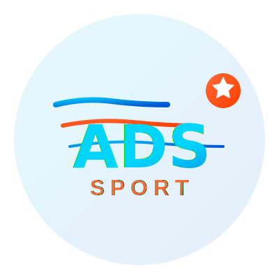
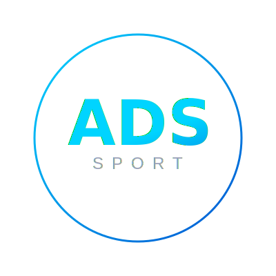
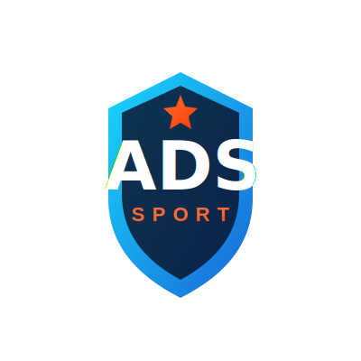
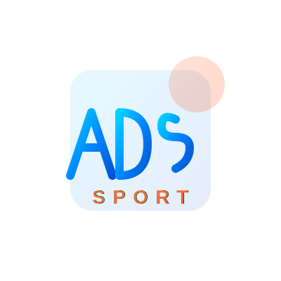
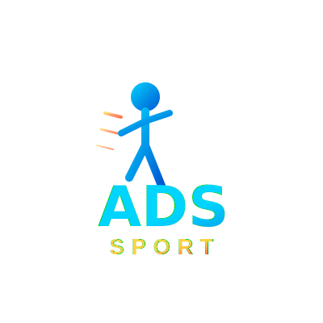
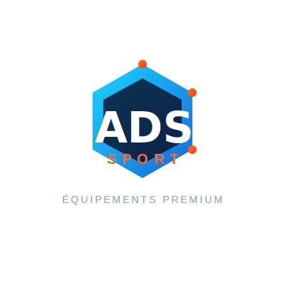
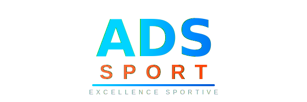

# Logos ADS Sport - Collection

Voici **8 variations** de logos professionnels pour ADS Sport. Le client peut choisir celui qui correspond le mieux à sa vision.

---

## 📁 Logo V1 - Dynamic (Original)

**Fichier:** `logo-v1-dynamic.svg`

**Caractéristiques:**
- Lignes de mouvement dynamiques
- Gradients cyan et orange
- Étoile d'excellence
- Style énergique et sportif

**Meilleur usage:** Site web, affichage digital, réseaux sociaux

---

## 📁 Logo V2 - Minimal

**Fichier:** `logo-v2-minimal.svg`

**Caractéristiques:**
- Design épuré et simple
- Cercle élégant
- Typographie claire
- Style minimaliste

**Meilleur usage:** Favicon, petits formats, applications mobiles

---

## 📁 Logo V3 - Badge

**Fichier:** `logo-v3-badge.svg`

**Caractéristiques:**
- Forme de bouclier/badge
- Look premium et professionnel
- Étoile au sommet
- Style prestige

**Meilleur usage:** Certificats, documents officiels, packaging

---

## 📁 Logo V4 - Modern Geometric

**Fichier:** `logo-v4-modern.svg`

**Caractéristiques:**
- Lettres stylisées géométriques
- Design contemporain
- Formes abstraites
- Style artistique

**Meilleur usage:** Branding moderne, galeries, expositions

---

## 📁 Logo V5 - Sport Icon

**Fichier:** `logo-v5-sport-icon.svg`

**Caractéristiques:**
- Icône de coureur en action
- Lignes de vitesse
- Très sportif et dynamique
- Style motivant

**Meilleur usage:** Enseignes, affiches, publicités sportives

---

## 📁 Logo V6 - Hexagon

**Fichier:** `logo-v6-hexagon.svg`

**Caractéristiques:**
- Forme hexagonale moderne
- Badge professionnel
- Tagline "Équipements Premium"
- Style tech et premium

**Meilleur usage:** Badges, stickers, emballages premium

---

## 📁 Logo V7 - Text Only (Horizontal)

**Fichier:** `logo-v7-text-only.svg`

**Caractéristiques:**
- Format horizontal
- Typographie pure
- Tagline "Excellence Sportive"
- Style clean

**Meilleur usage:** En-têtes de documents, signatures email, bannières web

---

## 📁 Logo V8 - Circle Modern

**Fichier:** `logo-v8-circle-modern.svg`

**Caractéristiques:**
- Cercles concentriques
- Design sophistiqué
- Points décoratifs
- Style élégant

**Meilleur usage:** Site web, cartes de visite, signalétique

---

## 🎨 Palette de Couleurs

Tous les logos utilisent la même palette cohérente :

- **Cyan électrique:** `#00D4FF` → `#0056D2`
- **Orange vibrant:** `#FF6B35` → `#FF3D00`
- **Jaune accent:** `#FFD23F`
- **Dark:** `#0A0E27`
- **Texte secondaire:** `#9AA0B8`

---

## 📦 Format

- **Format:** SVG (vectoriel scalable)
- **Résolution:** Infinie (peut être agrandi sans perte)
- **Couleurs:** Gradients professionnels
- **Compatibilité:** Tous navigateurs, logiciels de design

---

## 🎯 Recommandation

**Pour le site web:** **Logo V1 (Dynamic)** ou **Logo V8 (Circle Modern)**
- Design moderne et professionnel
- Animations possibles
- Excellent rendu sur tous écrans

**Pour l'enseigne/vitrine:** **Logo V3 (Badge)** ou **Logo V6 (Hexagon)**
- Forme distinctive
- Look premium
- Facile à reproduire en grand format

**Pour les documents:** **Logo V7 (Text Only)**
- Format horizontal pratique
- Lisible en petit
- Professionnel

---

## 💡 Note

Chaque logo est fourni en **SVG** (vectoriel), ce qui permet de:
- ✅ L'agrandir infiniment sans perte de qualité
- ✅ Le convertir en PNG, JPG, ou autre format
- ✅ Changer les couleurs facilement
- ✅ L'imprimer en haute qualité
- ✅ L'utiliser sur tout support (web, print, textile, etc.)

**Tous les logos sont prêts à l'emploi !**
